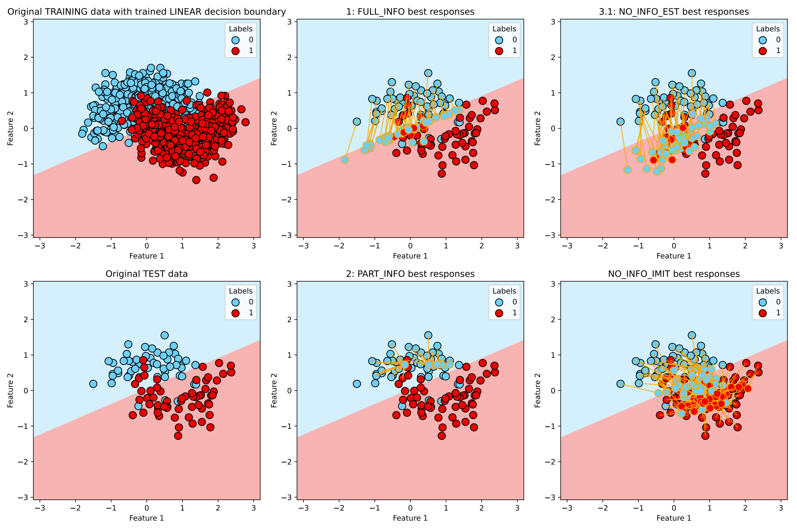
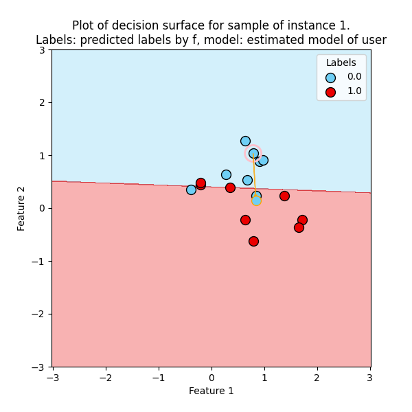
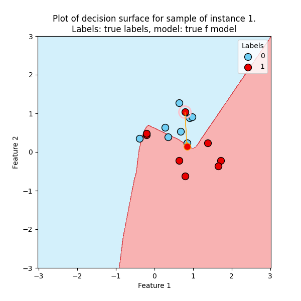
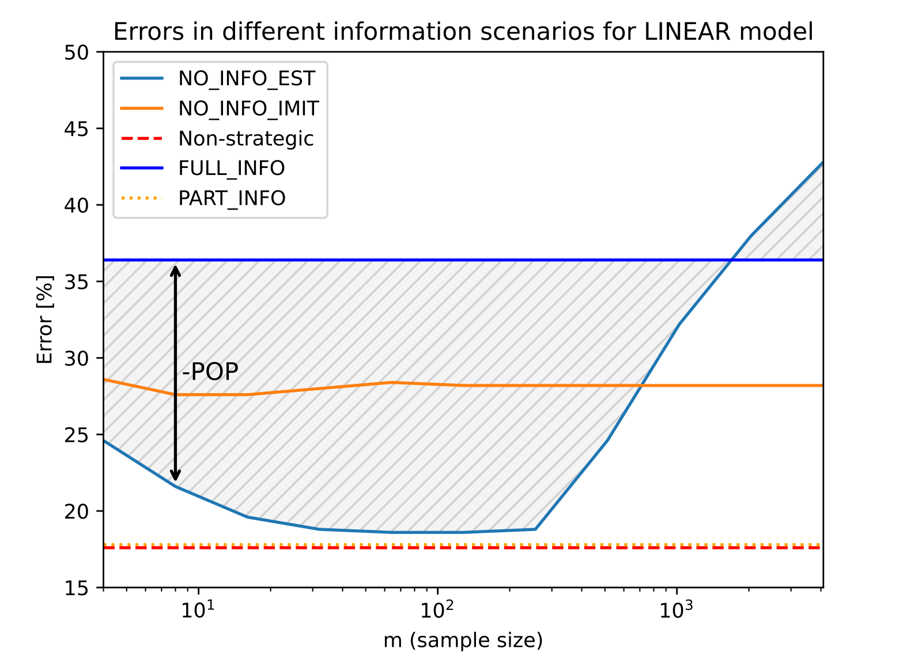
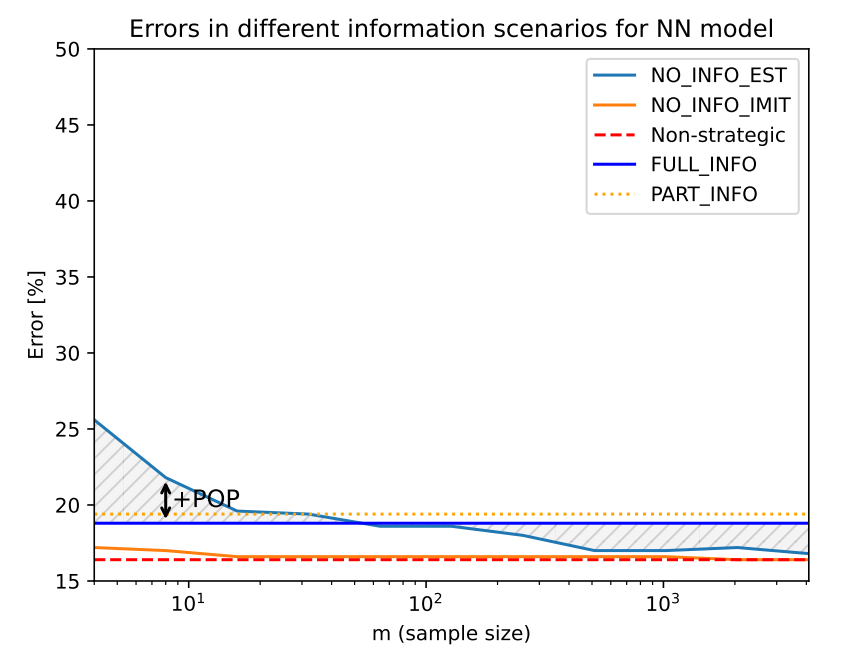

# Master Thesis: Strategic classification: the impact of user information and non-linear classification models

## Overview
This thesis implements various algorithms and functions for feature shifting and evaluation, utilizing for now a synthetic dataset. 
The main components include cost functions, plotting utilities, and modified regression techniques.

## File Structure

- **best_responses.py**: Contains the feature shifting algorithms that are used to modify features based on specified responses.

- **cost_functions.py**: Implements the cost function that evaluates the performance of the feature shifting algorithms.

- **dataset_0_synthetic.py**: Provides an elementwise simulation and evaluation on a synthetic dataset, enabling testing of the algorithms.

- **plotting.py**: Includes functions for visualizing results, helping to interpret the outcomes of the simulations and algorithms.

- **ridge.py**: Contains a modified version of the ridge regression algorithm, tailored because of version control issues.

- **weightedsampler.py**: Implements a weighted sampling method designed for scenarios with no information cases, as described in section 3.2.III of the project documentation.

--**data (folder)**: a folder containing the input loan datasets.

## Recreating the experiments

First create a new environment and use the requirements.txt file to install all packages.
For that you can use following lines:
  
      conda create -n strat_class_info python=3.9
      
      conda activate strat_class_inf
      
      pip install -r requirements.txt

### Experiments on synthetic data
To create the figures and tables in Section 6.1, you can run following lines:
  
      python strat_class_main.py
      python strat_class_main.py --moons
      python strat_class_main.py --moons --model_type nn 
      python strat_class_main.py --moons --model_type rnf 
      python strat_class_main.py --moons --model_type knn
      

For the **data stories**, following parameters were selected:
  
      python strat_class_main.py --moons --model_type nn --plotting_ind 1
      python strat_class_main.py --moons --model_type nn --plotting_ind 27
      python strat_class_main.py --moons --model_type nn --plotting_ind 60

      

  
  

### Experiments on loan data
To create the figures and tables in Section 6.2, you can run following lines:
  
      python strat_class_main.py --loan
      python strat_class_main.py --loan --model_type nn
      python strat_class_main.py --loan --model_type rnf
      python strat_class_main.py --loan --model_type knn
  

### Variations
To create the figures and tables in Section 6.3, you can run following lines:
        
      python strat_class_main.py --moons --model_type nn --t 0.01
      python strat_class_main.py --moons --model_type nn --t 10
      python strat_class_main.py --loan --model_type nn --t 0.01
      python strat_class_main.py --loan --model_type nn --t 10
      python strat_class_main.py --moons --model_type nn --eps 0.5
      python strat_class_main.py --moons --model_type nn --eps 0.8
      python strat_class_main.py --loan --model_type nn --eps 0.5
      python strat_class_main.py --loan --model_type nn --eps 0.8
  
     

